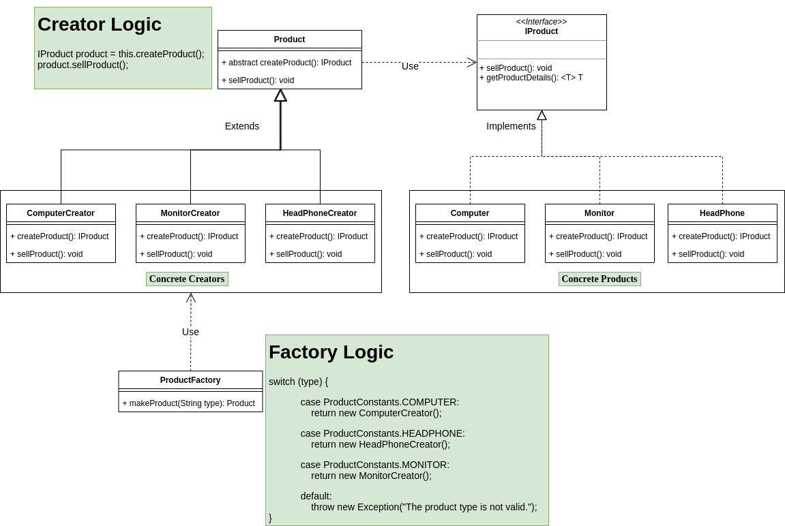

# poc-java-factory-pattern
Prove of Concept to learn and understand the design pattern Factory method using the programming language Java.

Content Table
=====================

<!--ts-->
* [About Factory Method](#about)
* [Class Diagram Flow](#diagram)
* [Code Structure](#code)
* [Factory Method Implementation](#implementation)
* [References](#references)
<!--te-->

<div id="about"/>

About Factory Method
====================
This POC is an example using the design pattern Factory Method with the programming language Java.
Before we talk about this implementation, let's understand the Factory method pattern:
<br/>
The Factory method pattern is used to greater flexibility to the code and brings us a creation concept, which, we must replace the creation of objects using a factory method that will be responsible for creating the objects and performing some action (business logic). 
<br/>
Below are the main classes used to implement the Factory method pattern:
<br/>
<br/>
<b>Product Class:</b>
```
Classes responsible for implementing the base Interface with all methods in common between the products (Objects).
```
<b>Product Base Interface:</b>
```
Interface (contract) with all methods in common between the products.
```
<b>Creator:</b>
```
Base class that has the factory method responsible for creating the Products (Objects) and implementing the business logic to be executed by the Products.
```
<b>Factory method:</b>
```
Factory method responsible for creating the Products (Objects). By definition the method must be abstract to force the Creators Subclasses to implement this method, and this method must have the same return type as the Interface implemented by the Products.
```
<b>Creators Classes:</b>
```
Subclasses of the creator class, responsible for implementing the factory method of creating the Products (Objects).
```

<div id="diagram"/>

Classes Diagram Flow
=======


<div id="code"/>

Code Structure
=====
___

### <b>Folder Structure</b>

```bash
├── pom.xml
├── README.md
├── src
│   ├── main
│   │   ├── java
│   │   │   └── br
│   │   │       └── com
│   │   │           └── poc
│   │   │               └── factory
│   │   │                   └── pattern
│   │   │                       ├── constants
│   │   │                       │   └── ProductConstants.java
│   │   │                       ├── creators
│   │   │                       │   ├── ComputerCreator.java
│   │   │                       │   ├── HeadPhoneCreator.java
│   │   │                       │   └── MonitorCreator.java
│   │   │                       ├── dto
│   │   │                       │   ├── ComputerDTO.java
│   │   │                       │   ├── HeadPhoneDTO.java
│   │   │                       │   └── MonitorDTO.java
│   │   │                       ├── factory
│   │   │                       │   ├── ProductFactory.java
│   │   │                       │   └── Product.java
│   │   │                       ├── interfaces
│   │   │                       │   └── IProduct.java
│   │   │                       ├── ProductMain.java
│   │   │                       └── products
│   │   │                           ├── Computer.java
│   │   │                           ├── HeadPhone.java
│   │   │                           └── Monitor.java
│   │   └── resources

```

<div id="implementation"/>

Factory Method Implementation
=============================


<div id="references"/>

References
=========