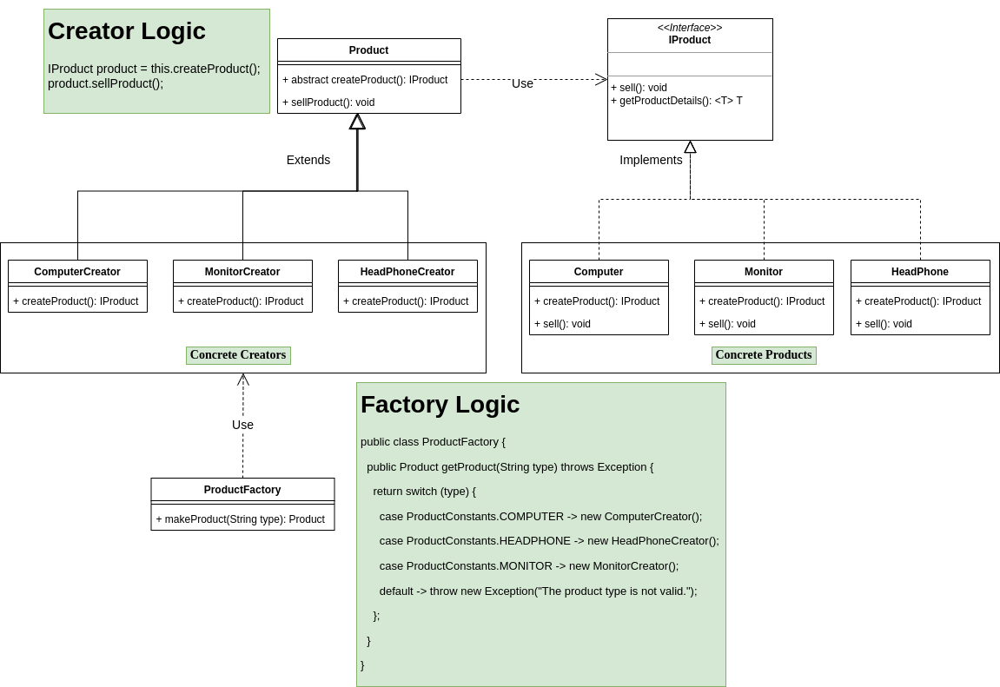

# poc-java-factory-pattern
This project is a sample to learn and understand the design pattern Factory method using the programming language Java, and could be applied in others languages like Typescript (JS), Python etc.

Content Table
=====================

<!--ts-->
* [About Factory Method](#about)
* [Class Diagram Flow](#diagram)
* [Code Structure](#code)
* [Factory Method Implementation](#implementation)
* [References](#references)
<!--te-->

<div id="about"/>

About Factory Method
====================
This POC is an example using the design pattern Factory Method with the programming language Java.
Before we talk about this implementation, let's understand the Factory method pattern:
<br/>
The Factory method pattern is used to greater flexibility to the code and brings us a creation concept, which, we must replace the creation of objects using a factory method that will be responsible for creating the objects and performing some action (business logic). 
<br/>
Below are the main classes used to implement the Factory method pattern:

<!--ts-->
- <b>Product Class:</b>
    - Classes responsible for implementing the base Interface with all methods in common between the products (Objects).
- <b>Product Base Interface:</b>
    - Interface (contract) with all methods in common between the products.
- <b>Creator:</b>
    - Base class that has the factory method responsible for creating the Products (Objects) and implementing the business logic to be executed by the Products.
- <b>Factory method:</b>
    - Factory method responsible for creating the Products (Objects). By definition the method must be abstract to force the Creators Subclasses to implement this method, and this method must have the same return type as the Interface implemented by the Products.
- <b>Creators Classes:</b>
    - Subclasses of the creator class, responsible for implementing the factory method of creating the Products (Objects).

<!--te-->

<div id="diagram"/>

Classes Diagram Flow
=======


<div id="code"/>

Code Structure
=====
___

### <b>Folder Structure</b>

```bash
├── pom.xml
├── README.md
├── src
│   ├── main
│   │   ├── java
│   │   │   └── br
│   │   │       └── com
│   │   │           └── poc
│   │   │               └── factory
│   │   │                   └── pattern
│   │   │                       ├── constants
│   │   │                       │   └── ProductConstants.java
│   │   │                       ├── creators
│   │   │                       │   ├── ComputerCreator.java
│   │   │                       │   ├── HeadPhoneCreator.java
│   │   │                       │   └── MonitorCreator.java
│   │   │                       ├── dto
│   │   │                       │   ├── ComputerDTO.java
│   │   │                       │   ├── HeadPhoneDTO.java
│   │   │                       │   └── MonitorDTO.java
│   │   │                       ├── factory
│   │   │                       │   ├── ProductFactory.java
│   │   │                       │   └── Product.java
│   │   │                       ├── interfaces
│   │   │                       │   └── IProduct.java
│   │   │                       ├── ProductMain.java
│   │   │                       └── products
│   │   │                           ├── Computer.java
│   │   │                           ├── HeadPhone.java
│   │   │                           └── Monitor.java
│   │   └── resources

```

<div id="implementation"/>

Factory Method Implementation
=======
Below we have the description of all classes and yours implementations.

## ProductMain.java
The ProductMain class is our client class, responsible for executing our application, 
in it we instantiate our class manufactures and from a type of product we execute its sales logic.
```java
package br.com.poc.factory.pattern;

import br.com.poc.factory.pattern.factory.Product;
import br.com.poc.factory.pattern.factory.ProductFactory;

public class ProductMain {
    private static Product product;
    private static ProductFactory productFactory;

    public static void main(String[] args) {
        productFactory = new ProductFactory();
        try {
            product = productFactory.getProduct("MONITOR");
            product.sellProduct();
        } catch (Exception e) {
            System.out.println("Unhandled error: " + e.getMessage());
            System.exit(0);
        }
    }
}
```


## DTO's (Data Transfer Object Classes).
The DTO's classes are the classes that have our attributes for each product and 
both implement the Serializable class if we have any manipulation of the class attributes in JSON objects.
#### Example:
```java
public class ComputerDTO implements Serializable {
    private String name;
    private int ramSize;
    private int hardDiskSize;
    private String processorName;

    public String getName() {
        return name;
    }

    public void setName(String name) {
        this.name = name;
    }

    public int getRamSize() {
        return ramSize;
    }

    public void setRamSize(int ramSize) {
        this.ramSize = ramSize;
    }

    public int getHardDisSize() {
        return hardDiskSize;
    }

    public void setHardDisSize(int hardDiskSize) {
        this.hardDiskSize = hardDiskSize;
    }

    public String getProcessorName() {
        return processorName;
    }

    public void setProcessorName(String processorName) {
        this.processorName = processorName;
    }

    @Override
    public String toString() {
        return new Gson().toJson(this);
    }
}

```

## Creators Classes
Below we have the implementation of our creator classes, responsible for creating the instance of the respective product.
They are our concrete instances of the Product class with the override of the factory method.
#### Examples:
```java
package br.com.poc.factory.pattern.creators;

import br.com.poc.factory.pattern.factory.Product;
import br.com.poc.factory.pattern.interfaces.IProduct;
import br.com.poc.factory.pattern.products.Computer;

public class ComputerCreator extends Product {
    @Override
    public IProduct createProduct() {
        return new Computer();
    }
}
```

```java
package br.com.poc.factory.pattern.creators;

import br.com.poc.factory.pattern.factory.Product;
import br.com.poc.factory.pattern.interfaces.IProduct;
import br.com.poc.factory.pattern.products.Monitor;

public class MonitorCreator extends Product {
    @Override
    public IProduct createProduct() {
        return new Monitor();
    }
}
```

## Common Product Interface:
The IProduct interface is our base product, which will be implemented by all the products we have,
in this case the classes: Computer, Monitor and HeadPhone.
####Example:
```java
package br.com.poc.factory.pattern.interfaces;

public interface IProduct {
    void sellProduct();

    <T> T getProductDetails();
}

```
## Products Classes:
Below we have the Products classes, which as said earlier in the topic [About Factory Method](#about), they are our concrete Products that will implement our interface with all the methods in common.
Each Product class has its implementation of base class methods. Let's see an example with the Computer class.
####Example:
```java
package br.com.poc.factory.pattern.products;

import br.com.poc.factory.pattern.dto.ComputerDTO;
import br.com.poc.factory.pattern.interfaces.IProduct;

import javax.swing.*;

public class Computer implements IProduct {
    private ComputerDTO computerDTO;

    public Computer() {
        this.computerDTO = new ComputerDTO();
    }

    @Override
    public void sellProduct() {
        JOptionPane.showMessageDialog(null, "Product Sold: " + this.getProductDetails(), "Factory Pattern", JOptionPane.INFORMATION_MESSAGE);
    }

    @Override
    public <T> T getProductDetails() {
        this.setComputer();
        return (T) this.computerDTO.toString();
    }

    public void setComputer() {
        this.computerDTO.setName("DELL");
        this.computerDTO.setRamSize(16000);
        this.computerDTO.setProcessorName("INTEL");
        this.computerDTO.setHardDisSize(2048);
    }
}
```

## Product Class:
The Product class is our special class that has our factory method, responsible for creating our Product, and from the created instance execute some business logic.
For this class, it doesn't matter how the logic is implemented in the product class, because for it what will really matter is if the class is returning what it wants,
and then proceed with the business logic implemented by the Products classes. As said earlier in the topic [About Factory Method](#about),
the factory method is abstract to force concrete creators to implement the factory method with the instance of the respective product.
#### Example:
```java
package br.com.poc.factory.pattern.factory;

import br.com.poc.factory.pattern.interfaces.IProduct;

public abstract  class Product {
    public abstract IProduct createProduct();

    public void sellProduct() {
        IProduct product = this.createProduct();
        System.out.println("Selling product: " + product.getProductDetails().toString());
        product.sellProduct();
    }
}

```

## Factory Class
Finally, we have the factory class, responsible for implementing the logic that will return the instance of the concrete creator Objects,
and from this instance, the client class (ProductMain.java) will execute the logic implemented by the creator class (Product.java).
Below is an example of how this logic works.
### Example:
```java
package br.com.poc.factory.pattern.factory;


import br.com.poc.factory.pattern.constants.ProductConstants;
import br.com.poc.factory.pattern.creators.ComputerCreator;
import br.com.poc.factory.pattern.creators.HeadPhoneCreator;
import br.com.poc.factory.pattern.creators.MonitorCreator;

public class ProductFactory {
    public Product getProduct(String type) throws Exception {
        switch (type) {
            case ProductConstants.COMPUTER:
                return new ComputerCreator();
            case ProductConstants.HEADPHONE:
                return new HeadPhoneCreator();
            case ProductConstants.MONITOR:
                return new MonitorCreator();
            default:
                throw new Exception("The product type is not valid.");
        }
    }

}
```
<div id="references"/>

References
=======

<!--ts-->
- Factory Method Example
  - https://refactoring.guru/pt-br/design-patterns/factory-method/java/example
- What is Factory Method
  - https://refactoring.guru/pt-br/design-patterns/factory-method
  - https://www.javatpoint.com/factory-method-design-pattern
<!--te-->